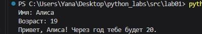
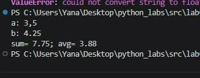
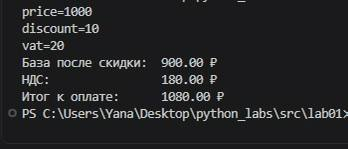
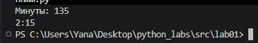
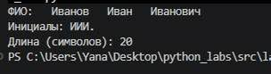

# ЛР1 - Ввод/вывод и форматирование
# 1 задание

```python
n = input("Имя: ")
y = int(input("Возраст:"))
print(f"Привет, {n}! Через год тебе будет {y+1}.")
```
# 2 задание

```python
a = float(input("a: ").replace(',', '.'))
b = float(input("b: ").replace(',', '.'))
sum = f"{a + b: .2f}"
avg = f"{(a + b)/2: .2f}"

print('sum=',sum,'; avg=', avg, sep = '')
```
# 3 задание

```python
price = float(input("price="))
disc = float(input("discount="))
vat = float(input("vat="))
base = price * (1 - disc/100)
vat_amount = base * (vat/100)
total = base + vat_amount
print('База после скидки:', f"{base: .2f}", '₽' )
print('НДС:              ', f"{vat_amount: .2f}", '₽')
print('Итог к оплате:    ', f"{total: .2f}", '₽')
```
# 4 задание

```python
m = int(input("Минуты: "))
m1 = m // 60
m2 = m % 60
print(f"{m1}:{m2:02d}", sep=':')
```
# 5 задание

