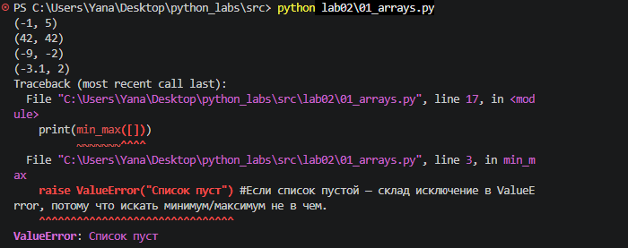
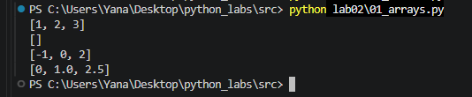
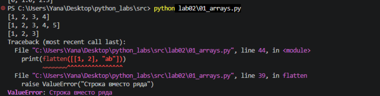
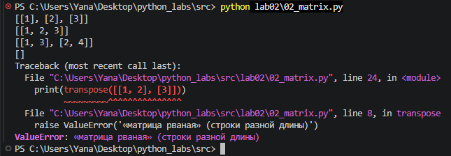
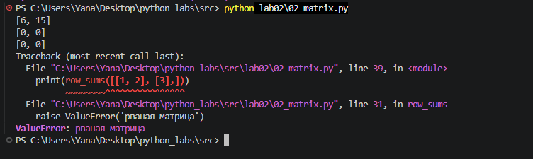
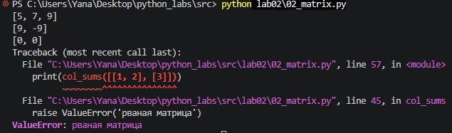

# Лабораторная работа №2 - Коллекции и матрицы (list/tuple/set/dict)
# Задание 1 — arrays.py
1. функция min_max возвращает кортеж из минимального и максимального элементов списка

```python
```


2. функция unique_sorted возвращает отсортированный список уникальных значений (по возрастанию)
```python
```


3. функция flatten превращает список списков/кортежей в один список по строкам (row-major)

```python
```


# Задание B — matrix.py

1. функция transpose меняет строки и столбцы матрицы местами

```python
```


2. функция row_sums возвращает список сумм по каждой строке матрицы

```python
```


3. функция unique_sorted возвращает список сумм по каждому столбцу матрицы

```python
```
