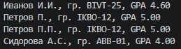

# Лабораторная работа №2 - Коллекции и матрицы (list/tuple/set/dict)
# Задание 1 — arrays.py
1. функция min_max возвращает кортеж из минимального и максимального элементов списка

```python
def min_max(nums: list[float | int]) -> tuple[float | int, float | int]:
    if len(nums) == 0:
        raise ValueError("Список пуст") #Если список пустой — склад исключение в ValueError, потому что искать минимум/максимум не в чем.
    mini = nums[0]
    maxi = nums[0]
    for i in nums:
        if i < mini:
            mini = i
        elif i > maxi:
            maxi = i
    return (mini, maxi)

print(min_max([3, -1, 5, 5, 0]))
print(min_max([42]))
print(min_max([-5, -2, -9]))
print(min_max([1.5, 2, 2.0, -3.1]))
print(min_max([]))
```


2. функция unique_sorted возвращает отсортированный список уникальных значений (по возрастанию)
```python
def unique_sorted(nums: list[float | int]) -> list[float | int]:
    nums = list(set(nums))
    for i in range(len(nums) - 1):
        for j in range(len(nums) - 1 - i):
            if nums[j] > nums[j + 1]:
                nums[j], nums[j + 1] = nums[j + 1], nums[j]
    return nums

print(unique_sorted([3, 1, 2, 1, 3]))
print(unique_sorted([]))
print(unique_sorted([-1, -1, 0, 2, 2]))
print(unique_sorted([1.0, 1, 2.5, 2.5, 0]))
```


3. функция flatten превращает список списков/кортежей в один список по строкам (row-major)

```python
def flatten(mat: list[list | tuple]) -> list:
    ans = []
    for i in mat:
        if type(i) == list or type(i) == tuple:
            ans += i
        else:
            raise ValueError("Строка вместо ряда")
    return ans
print(flatten([[1, 2], [3, 4]]))
print(flatten([[1, 2], (3, 4, 5)]))
print(flatten([[1], [], [2, 3]] ))
print(flatten([[1, 2], "ab"]))
```


# Задание B — matrix.py

1. функция transpose меняет строки и столбцы матрицы местами

```python
def transpose(mat: list[list[float | int]]) -> list[list]:
   
    for row in mat:
        if len(row) != len(mat[0]):
            raise ValueError('«матрица рваная» (строки разной длины)')
    if mat == []:
        return []
    cnt_stolb = len(mat[0])

    ans = []
    for j in range(cnt_stolb):
        a = []
        for row in mat:
            a.append(row[j])
        ans.append(a)
    return ans
print(transpose([[1, 2, 3]]))
print(transpose([[1], [2], [3]]))
print(transpose([[1, 2], [3, 4]]))
print(transpose([]))
print(transpose([[1, 2], [3]]))

```


2. функция row_sums возвращает список сумм по каждой строке матрицы

```python
def row_sums(mat: list[list[float | int]]) -> list[float]:

    for row in mat:
        if len(row)!=len(mat[0]):
            raise ValueError('pваная матрица')
    ans=[]
    for row in mat:
        ans.append(sum(row))
    return ans
print(row_sums([[1, 2, 3], [4, 5, 6]]))
print(row_sums([[-1, 1], [10, -10]]))
print(row_sums([[0, 0], [0, 0]]))
print(row_sums([[1, 2], [3],]))
```


3. функция unique_sorted возвращает список сумм по каждому столбцу матрицы

```python
def col_sums(mat: list[list[float | int]]) -> list[float]:


    for row in mat:
        if len(row) != len(mat[0]):
            raise ValueError('рваная матрица')
    ans = []
    stolbec = len(mat[0])
    for j in range(stolbec):
        cnt = 0
        for row in mat:
            cnt += row[j]
        ans.append(cnt)
    return ans
print(col_sums([[1,2,3],[4,5,6]]))
print(col_sums([[-1, 1], [10, -10]]))
print(col_sums([[0, 0], [0, 0]]))
print(col_sums([[1, 2], [3]]))
```


# Задание C — tuples.py

функция format_record обрабатывает ошибки при вводе информации и возвращает отформатированную строку вида: Иванов И.И., гр. BIVT-25, GPA 4.60

```python
3
def format_record(rec: tuple[str, str, float]) -> str:
    
    if len(rec)==3:
        fio,group,gpa = rec
    else:
        raise ValueError("Неверно введены данные")
    if not isinstance(rec,tuple):
        raise TypeError("На входе должен быть кортеж")
    if len(fio)==0:
        raise ValueError("Пустое имя")
    if not isinstance(fio, str):
        raise TypeError("Неверный тип ФИО")
    if len(group)==0:
        raise ValueError("Пустая группа")
    if not isinstance(group, str):
        raise TypeError("Неверный тип группы")
    if not gpa:
        raise ValueError("Пустой GPA")
    if not isinstance(gpa, float):
        raise TypeError("Неверный тип GPA")
    if not 0.0<=gpa<=5.0:
        raise ValueError("Неправильное значение: должно быть 0.0<=GPA<=5.0")

    fio_new=""

    fio=fio.split()
    if len(fio)<2 or len(fio)>3:
        raise ValueError("ФИО должно содержать 2-3 слова")
    if len(fio)==2:
        fio_new=fio[0].capitalize() + " " + fio[1][0].upper() + "."
    if len(fio)==3:
        fio_new=fio[0].capitalize() + " " + fio[1][0].upper() + "." + fio[2][0].upper() + "."

    return f"{fio_new}, гр. {group.strip()}, GPA {gpa:.2f}"


print(format_record(("Иванов Иван Иванович", "BIVT-25", 4.6)))
print(format_record(("Петров Пётр", "IKBO-12", 5.0)))
print(format_record(("Петров Пётр Петрович", "IKBO-12", 5.0)))
print(format_record(("  сидорова  анна   сергеевна ", "ABB-01", 3.999)))
```
